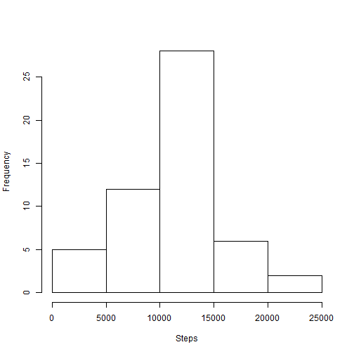
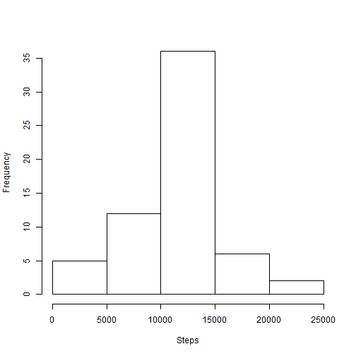

<br><br>

## 1. Loading and preprocessing the data

Setting working directory:

```r
setwd("C:/Kool/Data Science/5. Reproducible Research/Peer Assessment 1/RepData_PeerAssessment1")
```
Downloading and unzipping data (if neccesary):

```r
fileurl <- "https://d396qusza40orc.cloudfront.net/repdata%2Fdata%2Factivity.zip"
if (!file.exists("activity.csv")) {
    download.file(fileurl, destfile = "./repdata-data-activity.zip")
    unzip("repdata-data-activity.zip")    
}
```

Reading data:

```r
data  <- read.csv("activity.csv", header=T, col.names = c("Steps","Date","Interval"))
```

## 2. What is mean total number of steps taken per day?

Histogram of the total number of steps taken each day:

```r
agg <- aggregate(data$Steps ~ data$Date, data = data, sum)
names(agg) <- c("Date", "Steps")
agg$Steps <- as.numeric(agg$Steps)
hist(agg$Steps, xlab="Steps",main=NULL)
```

 

Mean total number of steps taken per day:

```r
mean(agg$Steps)
```

```
## [1] 10766
```
Median total number of steps taken per day:

```r
median(agg$Steps)
```

```
## [1] 10765
```

## 3. What is the average daily activity pattern?

Average number of steps taken, averaged across all days by  5-minute interval:

```r
agg2 <- aggregate(data$Steps ~ data$Interval, data = data, mean)
names(agg2) <- c("Interval", "Steps")
plot(agg2$Interval, agg2$Steps, type="l",xlab="Interval",ylab="Steps")
```

 

5-minute interval that on average across all the days contains the maximum number of steps:

```r
ord <- agg2[order(agg2$Steps),]
ord[nrow(ord),] 
```

```
##     Interval Steps
## 104      835 206.2
```
## 4. Imputing missing values

Total number of missing values in the dataset:

```r
sum(is.na(data$Steps))
```

```
## [1] 2304
```

Creating copy of the original dataset and filling in all of the missing values in the dataset using the mean for that 5-minute interval from exercise nr 3:

```r
newdata <- data
for(i in 1:length(data$Steps)){
  if(is.na(newdata$Steps[i])=="TRUE"){
      newdata$Steps[i] <- agg2[agg2$Interval==newdata$Interval[i],2]
  }
}
```

Histogram of the total number of steps taken each day (with the missing data filled in):

```r
agg3 <- aggregate(newdata$Steps ~ newdata$Date, data = newdata, sum)
names(agg3) <- c("Date", "Steps")
agg3$Steps <- as.numeric(agg3$Steps)
hist(agg3$Steps, xlab="Steps",main=NULL)
```

 

Mean total number of steps taken per day (with the missing data filled in):

```r
mean(agg3$Steps)
```

```
## [1] 10766
```
Median total number of steps taken per day (with the missing data filled in):

```r
median(agg3$Steps)
```

```
## [1] 10766
```

These values practically don't differ from the estimates from the first part of the assignment. Therefore there is no significant impact.

## 5. Are there differences in activity patterns between weekdays and weekends?

Setting locale time to English:

```r
Sys.setlocale("LC_TIME", "English")
```

```
## [1] "English_United States.1252"
```

Creating a new factor variable in the dataset with two levels (weekday and weekend):

```r
newdata$Wee <- weekdays(as.Date(newdata$Date))
for(i in 1:length(newdata$Wee)){
  if(newdata$Wee[i]=="Saturday"|newdata$Wee[i]=="Sunday"){
      newdata$Wee[i] <- "Weekend"
  }else{
      newdata$Wee[i] <- "Weekday"
  }
}
newdata$Wee <- as.factor(newdata$Wee)
```

Panel plot containing a time series plot of the 5-minute interval and the average number of steps taken, averaged across all weekdays or weekend days:

```r
agg4 <- aggregate(newdata$Steps ~ newdata$Interval+newdata$Wee, data = newdata, mean)
names(agg4) <- c("Interval", "Weekday","Steps")
library(lattice)
```

```
## Warning: package 'lattice' was built under R version 3.1.1
```

```r
xyplot(agg4$Steps~agg4$Interval|agg4$Weekday, data=newdata, type="l",layout=c(1,2),xlab = "Interval",ylab = "Number of steps")
```

 
